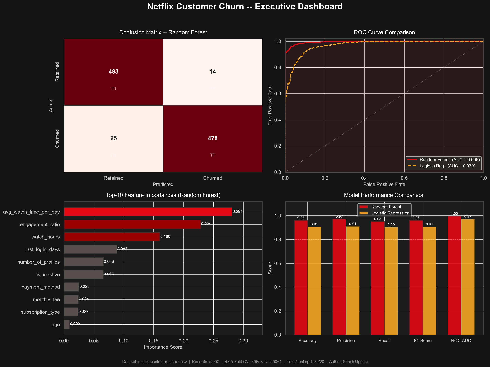

# 🎬 Netflix Customer Churn & Subscriber Retention Analytics

> **A production-grade Machine Learning classification system** that predicts individual subscriber churn risk, identifies behavioural drivers of cancellation, and delivers an executive-ready dashboard and strategic retention recommendations — all from a single unified Python script.

---

## 📌 Project Summary

Netflix's subscription model lives and dies by retention. This project tackles that problem head-on: using **5,000 anonymised Netflix customer records**, it trains a **Random Forest classifier** and a **Logistic Regression baseline** to predict — at the subscriber level — whether a customer is at risk of churning.

The pipeline covers the full ML lifecycle in one file:

- Exploratory data analysis
- Feature engineering (4 derived behavioural signals)
- Model training, cross-validation, and evaluation
- Auto-exported 4-panel executive dashboard (PNG)
- Console summary report with confusion matrix and all key metrics

### 🔑 Key Findings

| Metric | Random Forest | Logistic Regression |
|--------|:---:|:---:|
| **Accuracy** | **96.10%** | 90.60% |
| **Precision** | **97.15%** | 90.98% |
| **Recall** | **95.03%** | 90.26% |
| **F1-Score** | **96.08%** | 90.62% |
| **ROC-AUC** | **99.54%** | 97.03% |
| **5-Fold CV Accuracy** | **96.58% ± 0.61%** | — |

**Confusion Matrix (Random Forest — 1,000 test records):**

|  | Predicted: Retained | Predicted: Churned |
|--|:---:|:---:|
| **Actual: Retained** | 483 ✅ TN | 14 ❌ FP |
| **Actual: Churned** | 25 ❌ FN | 478 ✅ TP |

**Top Churn Predictors (Feature Importances):**

| Rank | Feature | Importance |
|------|---------|:---:|
| 1 | `avg_watch_time_per_day` *(engineered)* | 0.281 |
| 2 | `engagement_ratio` *(engineered)* | 0.229 |
| 3 | `watch_hours` | 0.160 |
| 4 | `last_login_days` | 0.088 |
| 5 | `number_of_profiles` | 0.066 |
| 6 | `is_inactive` *(engineered)* | 0.066 |
| 7 | `payment_method` | 0.025 |
| 8 | `monthly_fee` | 0.024 |
| 9 | `subscription_type` | 0.023 |
| 10 | `age` | 0.009 |

---

## 📂 Dataset

| Field | Details |
|-------|---------|
| **Source** | Kaggle — Netflix Customer Churn and Engagement Analytics |
| **URL** | [https://www.kaggle.com/datasets/zeyadmohamed26/netflix-customer-churn-and-engagement-analytics](https://www.kaggle.com/datasets/zeyadmohamed26/netflix-customer-churn-and-engagement-analytics) |
| **File** | `netflix_customer_churn.csv` |
| **Records** | 5,000 rows |
| **Features** | 14 raw columns + 4 engineered |
| **Target** | `churned` (binary: 0 = Retained, 1 = Churned) |
| **Missing Values** | None |
| **Class Balance** | 49.7% Retained / 50.3% Churned |

### Raw Feature Overview

| Column | Type | Description |
|--------|------|-------------|
| `customer_id` | string | Unique identifier (dropped before training) |
| `age` | int | Customer age (18–70) |
| `gender` | categorical | Male / Female / Other |
| `subscription_type` | categorical | Basic / Standard / Premium |
| `watch_hours` | float | Total hours watched |
| `last_login_days` | int | Days since last login (0–60) |
| `region` | categorical | Africa / Asia / Europe / North America / Oceania / South America |
| `device` | categorical | TV / Mobile / Tablet / Laptop |
| `monthly_fee` | float | $8.99 / $13.99 / $17.99 |
| `payment_method` | categorical | Credit Card / Debit Card / Crypto / Gift Card |
| `number_of_profiles` | int | Number of profiles on the account (1–5) |
| `avg_watch_time_per_day` | float | Average daily viewing hours |
| `favorite_genre` | categorical | Action / Comedy / Drama / Horror / Sci-Fi / etc. |
| `churned` | binary | **Target** — 0 Retained, 1 Churned |

---

## 📦 Project Deliverables

| File | Description |
|------|-------------|
| `SahithUppala_NetflixChurn.py` | **Main script** — single unified Python file covering data loading, EDA, feature engineering, model training, evaluation, and dashboard export |
| `netflix_executive_dashboard.png` | **Auto-generated** 4-panel executive dashboard (180 DPI) — Confusion Matrix, ROC Curves, Feature Importances, Model Performance Comparison |
| `SahithUppala_ProjectReport.docx` | **Full project report** — executive overview, KPIs, methodology, ML results, embedded dashboard, and strategic recommendations |
| `requirements.txt` | All Python dependencies with minimum version pins |
| `netflix_customer_churn.csv` | Source dataset (5,000 records, 14 features) |
| `README.md` | This file |

---

## ⚙️ Setup & Execution

### Prerequisites

- Python **3.9+** (tested on Python 3.14)
- `pip` package manager

### 1 — Clone / Download the project

```bash
# Clone the repository (or download and unzip)
git clone https://github.com/sahithuppala05/Netflix-Customer-Churn-Analytics
cd Netflix_Dataset
```

> **Dataset:** Download `netflix_customer_churn.csv` from the [Kaggle link above](https://www.kaggle.com/datasets/zeyadmohamed26/netflix-customer-churn-and-engagement-analytics) and place it in the project root.

### 2 — Install dependencies

```bash
pip install -r requirements.txt
```

`requirements.txt` contents:

```
numpy>=1.26.0
pandas>=2.2.0
matplotlib>=3.8.0
seaborn>=0.13.0
scikit-learn>=1.4.0
```

### 3 — Run the pipeline

```bash
python SahithUppala_NetflixChurn.py
```

### 4 — Expected output

```
======================================================================
  Netflix Customer Churn & Retention Prediction
======================================================================

[DATA]  Shape          : (5000, 14)
[DATA]  Missing values : 0
[SPLIT] Train size : 4000  |  Test size : 1000
[CV]    Random Forest 5-fold CV accuracy: 0.9658 +/- 0.0061

-------------------------------------------------------
  Model      : Random Forest
  Accuracy   : 0.9610  (96.10%)
  Precision  : 0.9715
  Recall     : 0.9503
  F1-Score   : 0.9608
  ROC-AUC    : 0.9954

[DASHBOARD]  Saved -> netflix_executive_dashboard.png
======================================================================
  FINAL EXECUTIVE SUMMARY
======================================================================
  Run complete. All outputs ready for report submission.
======================================================================
```

After a successful run, **`netflix_executive_dashboard.png`** will be created (or overwritten) in the project directory.

---

## 🏗️ Script Architecture

```
SahithUppala_NetflixChurn.py
│
├── Section 1 — Imports & Configuration
│     └── Netflix dark palette, headless matplotlib backend
│
├── Section 2 — Data Loading & Exploration
│     └── Shape, dtypes, null check, churn distribution, descriptive stats
│
├── Section 3 — Feature Engineering & Pre-processing
│     ├── Engineered: engagement_ratio, is_inactive, high_value, multi_profile_user
│     ├── Label encoding for all categorical columns
│     └── Stratified 80/20 train-test split + StandardScaler for LR
│
├── Section 4 — Model Training
│     ├── Random Forest (200 trees, depth 12, balanced class weights)
│     ├── Logistic Regression (L2, balanced, max_iter=1000)
│     └── 5-Fold Stratified Cross-Validation on Random Forest
│
├── Section 5 — Model Evaluation
│     ├── Accuracy, Precision, Recall, F1, ROC-AUC
│     ├── Confusion matrix for both models
│     ├── Full sklearn classification_report
│     └── Feature importance ranking
│
├── Section 6 — Executive Dashboard (→ netflix_executive_dashboard.png)
│     ├── Panel 1 (TL): Confusion Matrix heatmap
│     ├── Panel 2 (TR): ROC Curve — RF vs Logistic Regression
│     ├── Panel 3 (BL): Top-10 Feature Importances (horizontal bar)
│     └── Panel 4 (BR): Grouped bar — all 5 metrics side-by-side
│
└── Section 7 — Console Executive Summary Table
```

---

## 📊 Executive Dashboard Preview

> Auto-generated and saved as `netflix_executive_dashboard.png`



---

## 🎯 Strategic Recommendations (Summary)

| # | Recommendation | Key Driver | Proposed Action |
|---|---------------|-----------|----------------|
| 1 | **Engagement Early Warning** | `avg_watch_time_per_day` (0.281) | CRM churn-score API — trigger alerts when daily watch < 0.3 hrs for 3 days |
| 2 | **Inactivity Window Intervention** | `last_login_days` (0.088) | 3-touch win-back campaign starting at Day 20 (pre-threshold) |
| 3 | **Multi-Profile Stickiness** | `number_of_profiles` (0.066) | Prompt single-profile at-risk users to add a family profile (free 30-day trial) |
| 4 | **Premium Tier Retention** | `monthly_fee` + `subscription_type` | Risk-weighted retention budget — Premium users receive concierge-level offers |

---

## 👤 Author

**Sahith Uppala**  
Netflix Customer Churn & Subscriber Retention Analytics  
Python ML Project — Random Forest Classification Pipeline

---

*Dataset source: [Kaggle — Netflix Customer Churn and Engagement Analytics](https://www.kaggle.com/datasets/zeyadmohamed26/netflix-customer-churn-and-engagement-analytics)*
